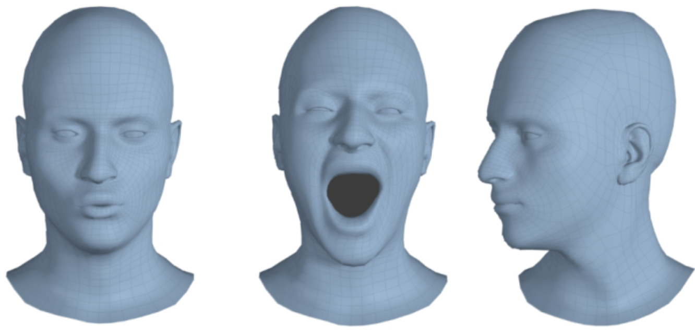
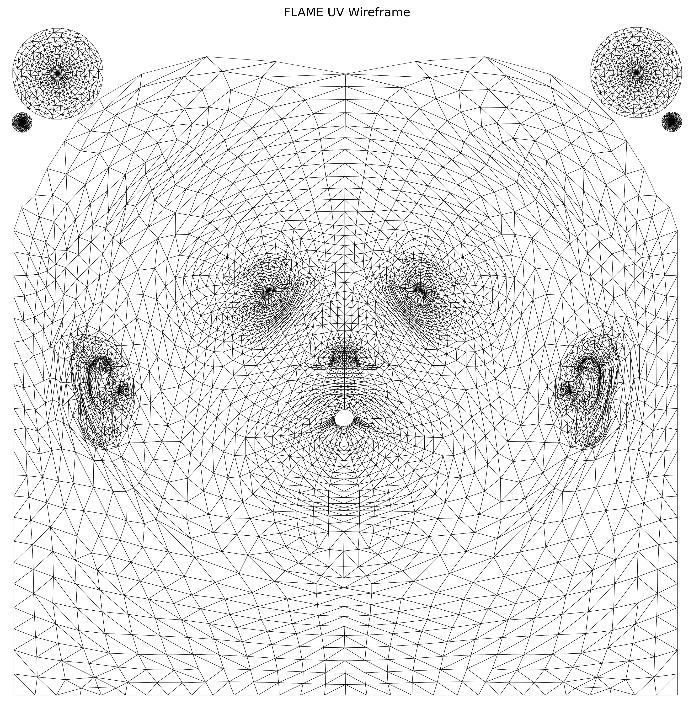

Meshes and UV maps are core to 3D graphics—they define shape and texture placement. From gaming and film to AR/VR and avatars, understanding how they work together is key to creating realistic and efficient digital content. This blog covers the basics and shows how they're used in practice.

### 3D Mesh and FLAME 

A 3D mesh is a collection of vertices, edges, and faces that define the surface of a 3D object—like a wireframe sculpture. It forms the structural backbone of digital models used in games, animation, simulations, and 3D avatars. Common file formats include .obj, .ply, and .glb. For example, a human face mesh may consist of thousands of vertices and triangular faces to capture fine geometric detail.

The FLAME [1] model (Faces Learned with an Articulated Model and Expressions) is a widely used parametric 3D head mesh model designed for realistic facial animation. It represents the face with 5023 vertices and 9976 triangles, controlled by identity, expression, and pose parameters. FLAME uses linear blend skinning (LBS) and blendshapes for expressive deformation, making it compact and efficient for applications like 3D avatars, facial reenactment, and neural rendering from 2D images or videos.

  

<em>Figure 1: FLAME head mesh with different poses.[2]</em>
  

### What Is UV Mapping?

**UV mapping** is a 2D representation of a 3D surface used for texture mapping. Think of it as creating a flat blueprint of a curved 3D object—like unfolding a globe into a world map or unwrapping a chocolate bar to see its flat wrapper layout.

#### Understanding U and V Coordinates

The letters **U** and **V** represent 2D coordinates in texture space, similar to how **X** and **Y** work in regular 2D graphics:
- **U** corresponds to the horizontal axis (0 to 1, left to right)
- **V** corresponds to the vertical axis (0 to 1, bottom to top)
- These coordinates are completely independent from the 3D **XYZ** coordinates of the mesh

#### The Chocolate Bar Analogy

Imagine unwrapping a chocolate bar:
1. **3D Object**: The wrapped chocolate bar has a complex curved surface
2. **UV Map**: When you carefully unfold the wrapper, you get a flat 2D layout
3. **Texture Mapping**: The printed design on the wrapper (logos, text, patterns) corresponds to how textures are applied to the 3D surface

This unwrapping process is exactly what UV mapping does—it takes the complex 3D surface and "unfolds" it into a flat 2D space where textures can be painted or applied.

#### Why UV Coordinates?

UV coordinates are normalized (0 to 1 range), making them resolution-independent. Whether your texture is 256×256 pixels or 4096×4096 pixels, the same UV coordinates will work perfectly.

  

<em>Figure 2: UV MAP of FLAME.</em>
  

### How FLAME Mesh and UV Map Work Together

The FLAME model provides a 3D mesh of the human head, defined by **5023 vertices** and **9976 triangular faces**, while the pre-calculated UV map offers a 2D representation of that mesh surface. The **matching** between the FLAME mesh and its UV map is defined by a **per-vertex correspondence**, where each vertex in 3D space has an associated **(u, v)** coordinate in 2D UV space.

Here's how the matching works:

* Each triangle in the FLAME mesh consists of 3 vertices indexed in 3D space.
* The same triangle has corresponding UV coordinates for those 3 vertices in 2D.
* When rendering or texturing, the **3D triangle** is mapped to its **2D counterpart** using these UV coordinates.
* This mapping allows a 2D texture image to wrap seamlessly over the 3D mesh surface.

In practice, you often have:

* A **vertex list**: 3D coordinates (x, y, z) for each vertex.
* A **face list**: triplets of vertex indices (defining triangles).
* A **UV list**: (u, v) coordinates per vertex.
* A **UV face list**: triplets of UV indices (corresponding to vertex indices in face list).

So, the structure allows the renderer or processing tool to:

* Match each triangle's 3D geometry to its corresponding UV triangle.
* Sample texture values from the UV space during rendering or neural feature mapping (e.g., in 3DGS or GEM).

###  Techniques for UV Mapping

UV mapping can be done manually using tools like Blender or Maya for precise control, or automatically for faster results. Good UV maps minimize distortion and avoid stretching by carefully placing seams and organizing UV islands. Clean mapping is key for accurate texture placement and visual quality.

### Why UV Mapping Matters

UV mapping is essential for applying textures, PBR materials, baked normals, and lightmaps, enabling detailed and stylized 3D visuals. It also plays a key role in neural rendering, such as mapping 3D Gaussians onto UV space for efficient and high-fidelity avatar synthesis.

### Tools and Code Snippets

Tools like Trimesh and Open3D allow easy access to mesh geometry and UV coordinates in code. You can use them to load meshes, extract UVs, and sample points on the UV map for tasks like texture transfer or feature alignment. Advanced techniques like Poisson disk sampling on the UV map enable uniform point distribution, useful for generative models and neural rendering pipelines.

### Conclusion

Mesh and UV mapping form the foundation of 3D graphics, enabling detailed geometry and rich texture placement across digital models. Whether you're working on games, films, or avatars, mastering these concepts is essential. Try loading a simple mesh and unwrapping it yourself to see how UVs bring textures to life—tools like Blender or code notebooks make it easy to get started.

### References

[1] Li, Tianye, Timo Bolkart, Michael J. Black, Hao Li, and Javier Romero. "Learning a model of facial shape and expression from 4D scans." ACM Trans. Graph. 2017.

[2] https://github.com/TimoBolkart/FLAME-Universe
